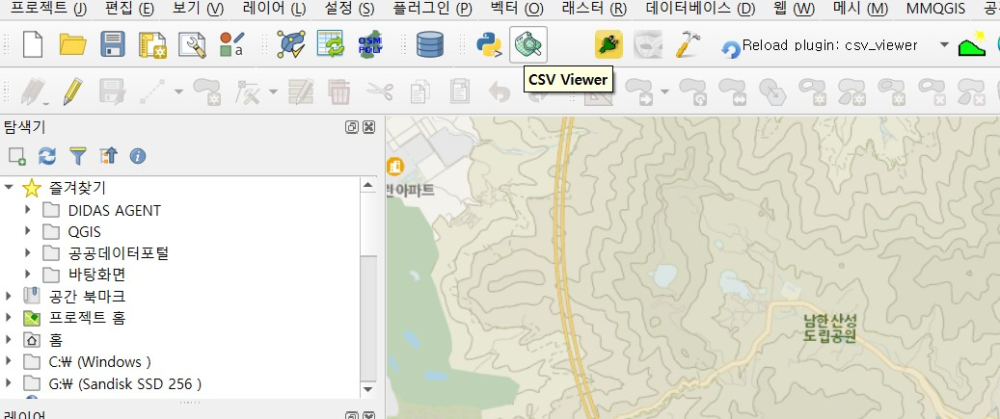
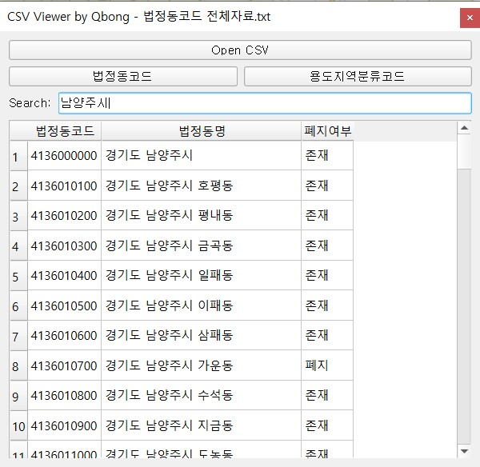
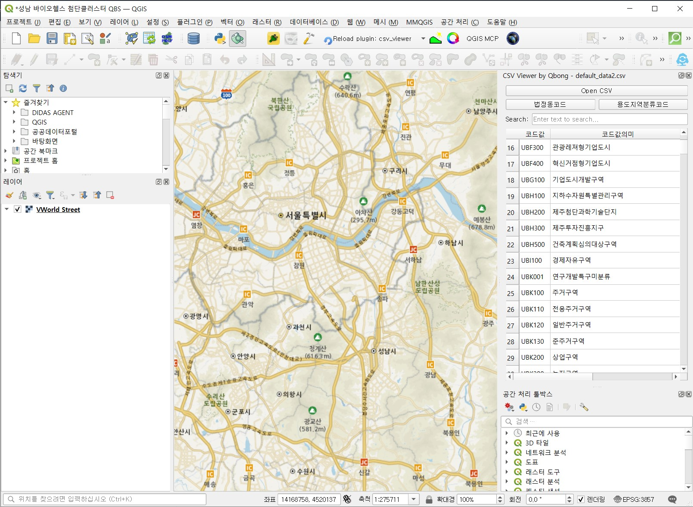
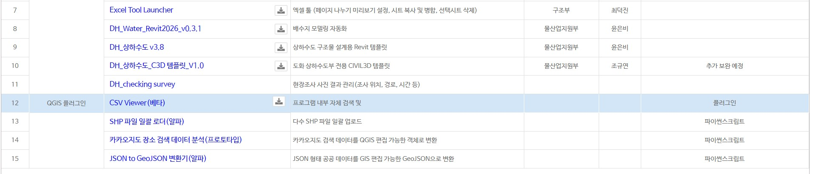
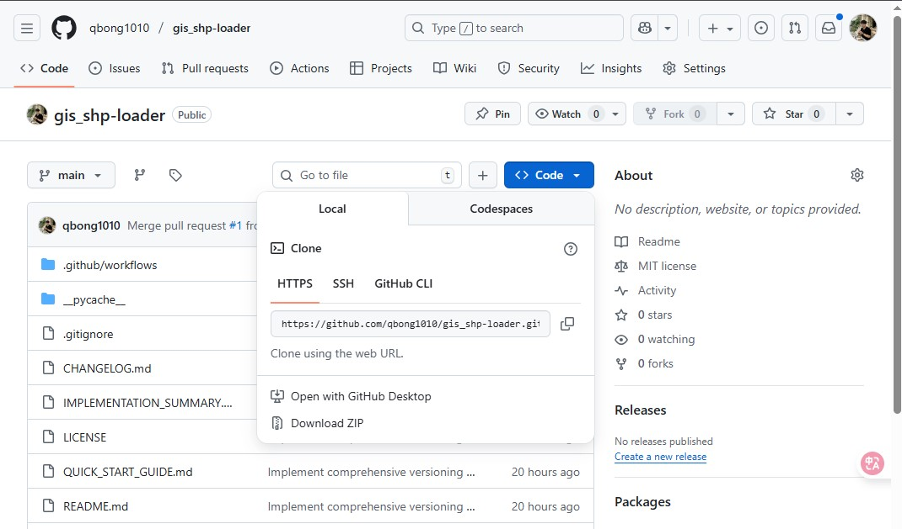

# CSV 뷰어 (CSV Viewer)

QGIS 환경에서 CSV 파일을 효율적으로 조회하고 검색할 수 있는 전문 플러그인입니다.

---

## 개요

CSV 뷰어는 QGIS 사용자를 위한 경량화된 CSV 파일 뷰어입니다. 별도의 외부 프로그램 없이 QGIS 내에서 직접 CSV 데이터를 조회하고 검색할 수 있습니다.

### 주요 기능

- **간편한 파일 로드**: CSV 파일을 빠르게 불러오기
- **테이블 뷰**: 데이터를 구조화된 테이블 형식으로 표시
- **실시간 검색**: 키워드 기반 데이터 필터링 및 검색
- **내장 데이터**: 법정동코드, 용도지역분류코드 등 자주 사용하는 데이터 내장

---

## 사용 방법

### 1. 플러그인 실행
QGIS 도구 모음에서 CSV 뷰어 아이콘을 클릭하여 플러그인을 실행합니다.

### 2. 법정동코드 조회
법정동코드 메뉴를 선택하여 전국 법정동코드를 조회하고 검색할 수 있습니다.

### 3. 용도지역분류코드 조회
용도지역분류코드 메뉴에서 관련 코드 정보를 확인할 수 있습니다.

### 4. 사용자 정의 CSV 파일 불러오기
"Open CSV" 버튼을 클릭하여 원하는 CSV 파일을 불러와 QGIS 환경에서 직접 조회할 수 있습니다.

---

## 설치 방법

### 1. ZIP 파일 다운로드

다음 두 가지 방법 중 하나를 선택하여 플러그인 ZIP 파일을 다운로드합니다.

**방법 1: 디다스(DIDAS)에서 다운로드**

**방법 2: GitHub 저장소에서 다운로드**

[GitHub 저장소](https://github.com/qbong1010/qgis_CsvViewer)에서 `<> Code` → `Download ZIP` 선택

### 2. QGIS에 플러그인 설치

1. QGIS를 실행하고 상단 메뉴에서 `플러그인` → `플러그인 관리 및 설치`를 선택합니다.
2. `ZIP에서 설치` 탭을 클릭합니다.
3. 다운로드한 ZIP 파일을 선택하고 `플러그인 설치` 버튼을 클릭합니다.

---

## 주요 특징

- **💡 간편성**: 직관적인 인터페이스로 빠른 CSV 데이터 조회
- **🎨 최적화된 UI**: 깔끔한 디자인으로 작업 집중도 향상
- **⚡ 워크플로 통합**: QGIS 환경과 완벽하게 통합되어 별도의 프로그램 전환 불필요
- **🔍 강력한 검색**: 실시간 필터링으로 필요한 정보를 빠르게 찾기

---

## 피드백 및 기여

CSV 뷰어는 GIS 실무자들의 작업 효율성 향상을 위해 개발되었습니다. 사용자 여러분의 다양한 의견과 제안을 환영하며, 지속적인 업데이트를 통해 더 나은 도구로 발전시켜 나가겠습니다.

---

## 버그 리포트 및 기능 제안

버그를 발견하셨거나 새로운 기능을 제안하고 싶으시다면 다음의 방법으로 알려주세요:

- **GitHub Issues**: [이슈 탭](https://github.com/qbong1010/qgis_CsvViewer/issues)에서 `New issue` 버튼을 클릭하여 등록
- **이메일 문의**: urbanbong@dohwa.co.kr

모든 피드백은 플러그인 개선에 소중하게 활용됩니다.

---

## 라이선스

이 프로젝트는 MIT 라이선스 하에 배포됩니다. 자세한 내용은 [LICENSE](LICENSE) 파일을 참조하세요.

---

## 개발자 정보

**개발**: QBong from DOHWA  
**문의**: urbanbong@dohwa.co.kr  
**GitHub**: [qbong1010/qgis_CsvViewer](https://github.com/qbong1010/qgis_CsvViewer)